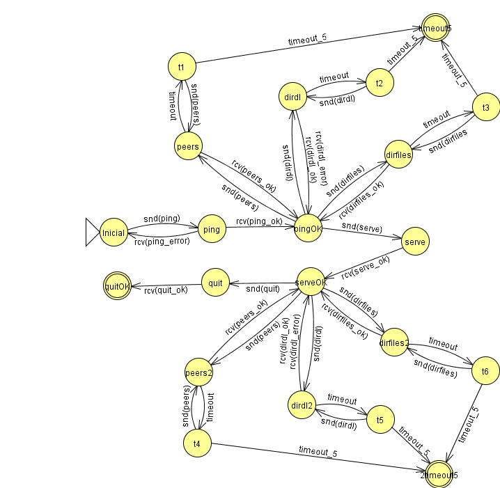
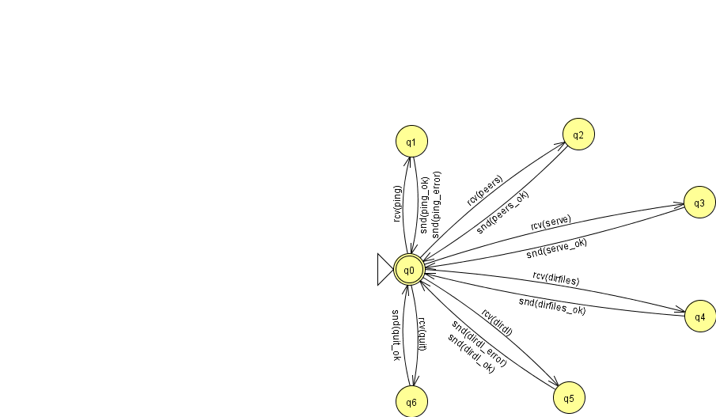
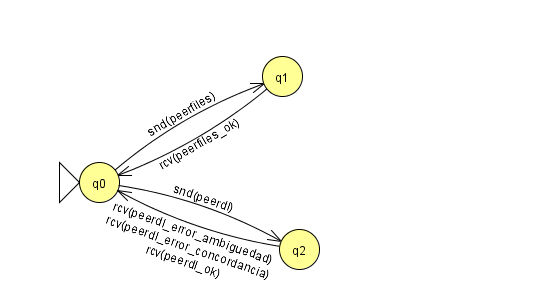
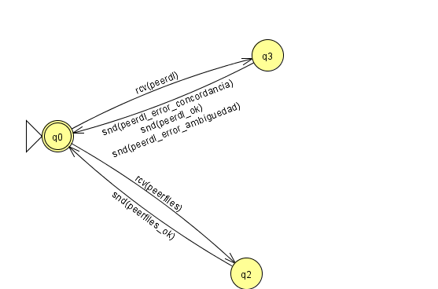

# Redes de Comunicaciones — Proyecto NanoFiles

**Universidad de Murcia**
**Curso 2025/2026**

**Autoras:** Nicole Muñoz Mahecha · Laura Pagán Caballero
**Profesor:** Juan José Pujante Moreno

---

## Índice de contenido

1. [Introducción](#1-introducción)
2. [Protocolos diseñados](#2-protocolos-diseñados)
   - 2.1 [Directorio (UDP)](#21-directorio-udp)
     - 2.1.1 [Formato de los mensajes](#211-formato-de-los-mensajes)
     - 2.1.2 [Autómatas cliente y servidor](#212-autómatas-cliente-y-servidor)
   - 2.2 [Peers (TCP)](#22-peers-tcp)
     - 2.2.1 [Tipos y descripción de los mensajes](#221-tipos-y-descripción-de-los-mensajes)
     - 2.2.2 [Autómatas cliente y servidor](#222-autómatas-cliente-y-servidor)
3. [Mejoras implementadas](#3-mejoras-implementadas)
   - 3.1 [dirdl ampliado](#31-dirdl-ampliado)
   - 3.2 [dirfiles ampliado](#32-dirfiles-ampliado)
   - 3.3 [quit](#33-quit)
4. [Wireshark](#4-wireshark)
5. [Conclusiones](#5-conclusiones)


---

## 1. Introducción

En este documento se especifica el diseño, la estructura y la implementación de los protocolos de red que sustentan el funcionamiento de nuestro programa NanoFiles. El sistema se apoya en una arquitectura híbrida que hace uso de dos protocolos fundamentales de la capa de transporte: UDP y TCP.

A lo largo de esta memoria se detallan los formatos de los mensajes diseñados (textuales para el Directorio y binarios multiformato para la red P2P), así como los autómatas de estado de los roles cliente y servidor en ambas arquitecturas.

Además, se documenta en profundidad la resolución de diversas funcionalidades avanzadas y mejoras implementadas en el sistema. Entre estas mejoras destacan:

- **`dirdl` ampliado:** la descarga de ficheros a través de UDP, garantizando la integridad de los datos mediante procesos de serialización y deserialización en Base64.
- **`dirfiles` ampliado:** la gestión eficiente de listados de ficheros de gran tamaño mediante la técnica de fragmentación a nivel de aplicación (*chunks*), asegurando que los datagramas no superen el límite de la MTU de la red y controlando las pérdidas mediante temporizadores (*timeouts*).
- **`quit`:** el desarrollo de un mecanismo de desconexión seguro que incluye validación de identidad (IP) para proteger el registro del directorio.

Finalmente, el documento incluye una sección de validación empírica en la que se analiza el tráfico de red capturado con la herramienta Wireshark, demostrando visual y técnicamente la correcta correspondencia entre el diseño teórico de nuestros protocolos y su ejecución real sobre la red.

---

## 2. Protocolos diseñados

### 2.1 Directorio (UDP)

Para definir el protocolo de comunicación con el Directorio vamos a utilizar mensajes textuales con formato `campo:valor`. El valor que tome el campo `operation` (código de operación) indicará el tipo de mensaje y, por tanto, su formato (qué campos vienen a continuación).

#### 2.1.1 Formato de los mensajes

**Mensaje: `ping`**

- **Sentido de la comunicación:** Cliente → Directorio
- **Descripción:** este mensaje lo envía el cliente de NanoFiles al Directorio para establecer la conexión con el servidor.

*Ejemplo:*

```text
operation: ping\n
protocolid: 123456789A\n
\n
```

**Mensaje: `ping_ok`**

- **Sentido de la comunicación:** Directorio → Cliente
- **Descripción:** este mensaje lo envía el directorio como respuesta al mensaje `ping` cuando se ha establecido la conexión.

*Ejemplo:*

```text
operation: ping_ok\n
\n
```

**Mensaje: `ping_error`**

- **Sentido de la comunicación:** Directorio → Cliente
- **Descripción:** este mensaje lo envía el directorio como respuesta al mensaje `ping` cuando no se ha podido establecer la conexión.

*Ejemplo:*

```text
operation: ping_error\n
\n
```

**Mensaje: `dirfiles` [AMPLIADO]**

- **Sentido de la comunicación:** Cliente → Directorio
- **Descripción:** este mensaje lo envía el cliente al Directorio para solicitar una lista de los ficheros existentes en el directorio.

*Ejemplo:*

```text
operation: dirfiles\n
\n
```

**Mensaje: `dirfiles_ok`**

- **Sentido de la comunicación:** Directorio → Cliente
- **Descripción:** este mensaje lo envía el directorio con una lista de los ficheros del directorio. Los ficheros se envían en varios *chunks*, indicando el número de *chunk* que se envía (`chunkactual`) y el total de *chunks* que se van a enviar (`chunkstotales`).

> **Nota:** para el ejemplo se ha asignado el valor `2` a la variable `MAX_FICHEROS_CHUNK`.

*Ejemplo:*

```text
operation:dirfiles_ok\n
chunkactual:1\n
chunkstotales:2\n
filename:dirdl_fich_largo.txt\n
filehash:c78291898a401bfa9f45943bebde6af1dbafbc3d\n
filesize:6734\n
filename:otraaaaa.txt\n
filehash:1eb0f77975621f26a4f73c83a66a7b3d6effd3c1\n
filesize:6\n
\n
operation:dirfiles_ok\n
chunkactual:2\n
chunkstotales:2\n
filename:lunes.txt\n
filehash:332e202f17e9f07f2c188625bf63959da2036510\n
filesize:13\n
filename:otro.txt\n
filehash:6dbe12072e3faf5c711f2b3a996f677b9f97e07a\n
filesize:11\n
\n
```

**Mensaje: `peers`**

- **Sentido de la comunicación:** Cliente → Directorio
- **Descripción:** este mensaje lo envía el cliente de NanoFiles al Directorio para solicitar la lista de los pares registrados.

*Ejemplo:*

```text
operation: peers\n
\n
```

**Mensaje: `peers_ok`**

- **Sentido de la comunicación:** Directorio → Cliente
- **Descripción:** el directorio responde al cliente con una lista de los pares registrados, indicando su *nickname* y su dirección de escucha (IP:puerto TCP).

*Ejemplo:*

```text
operation:peers_ok\n
peernickname:jim7\n
peerip:127.0.0.1\n
peerport:60342\n
peernickname:eric6\n
peerip:127.0.0.1\n
peerport:61372\n
\n
```

**Mensaje: `serve`**

- **Sentido de la comunicación:** Cliente → Directorio
- **Descripción:** este mensaje lo envía el cliente para lanzar un servidor de ficheros que escucha en un puerto TCP (`serveport`), asociándolo al *nickname* del par (`servepeer`) y registrándolo.

*Ejemplo:*

```text
operation: serve\n
```

**Mensaje: `serve_ok`**

- **Sentido de la comunicación:** Directorio → Cliente
- **Descripción:** este mensaje lo envía el directorio para indicar que el servidor se ha registrado de forma exitosa.

*Ejemplo:*

```text
operation:serve_ok\n
servepeer:jim2\n
serveip:127.0.0.1\n
serveport:10000\n
\n
```

**Mensaje: `dirdl` [AMPLIADO]**

- **Sentido de la comunicación:** Cliente → Directorio
- **Descripción:** este mensaje lo envía el cliente de NanoFiles al Directorio para descargar un fichero de cualquier tipo (texto o binario) a partir de una subcadena del hash.

*Ejemplo:*

```text
operation: dirdl\n
dirdlhashSubstring: 30c732\n
\n
```

**Mensaje: `dirdl_ok`**

- **Sentido de la comunicación:** Directorio → Cliente
- **Descripción:** este mensaje lo envía el directorio para confirmar al cliente que el fichero se ha descargado con éxito. Además del fichero descargado, se envían varios *chunks*, indicando el número de *chunk* que se envía (`chunkactual`) y el total de *chunks* que se van a enviar (`chunkstotales`).

*Ejemplo:*

```text
operation:dirdl_ok\n
chunkactual:1\n
chunkstotales:1\n
posicion:0\n
dirdlname:10.txt\n
dirdlhash:01b307acba4f54f55aafc33bb06bbbf6ca803e9a\n
dirdlsize:10\n
dirdldata:MTIzNDU2Nzg5MA==\n
\n
```

**Mensaje: `dirdl_error`**

- **Sentido de la comunicación:** Directorio → Cliente
- **Descripción:** este mensaje lo envía el directorio para informar al cliente de que la cadena hash no es válida o es ambigua.

*Ejemplo:*

```text
operation: dirdl_error\n
\n
```

**Mensaje: `quit`**

- **Sentido de la comunicación:** Cliente → Directorio
- **Descripción:** este mensaje lo envía el cliente de NanoFiles al Directorio cuando un peer ejecuta el comando, para comunicar que dicho peer desea darse de baja del servidor.

*Ejemplo:*

```text
operation: quit\n
quitnickname: jim2\n
\n
```

**Mensaje: `quit_ok`**

- **Sentido de la comunicación:** Directorio → Cliente
- **Descripción:** este mensaje lo envía el directorio para informar al cliente de que la ejecución del programa ha terminado con éxito.

*Ejemplo:*

```text
operation: quit_ok\n
\n
```

#### 2.1.2 Autómatas cliente y servidor

**Autómata rol cliente de directorio**



**Autómata rol servidor de directorio**



### 2.2 Peers (TCP)

Para definir el protocolo de comunicación con un servidor de ficheros vamos a utilizar mensajes binarios multiformato. El valor que tome el campo `opcode` (código de operación) indicará el tipo de mensaje y, por tanto, cuál es su formato, es decir, qué campos vienen a continuación.

#### 2.2.1 Tipos y descripción de los mensajes

**Mensaje: `peerfiles` (opcode = 1)**

- **Sentido de la comunicación:** Cliente → Servidor de ficheros
- **Descripción:** este mensaje lo envía el cliente de NanoFiles al servidor de ficheros para solicitar los ficheros disponibles en el peer servidor.

| Opcode (1 byte) | Longitud | Valor |
|---|---|---|
| 0x01 | 1/2/4 bytes | n bytes |

*Ejemplo:*

```text
operation: peerfiles\n
peerfilenickname: jim2\n
\n
```

**Mensaje: `peerfiles_ok` (opcode = 2)**

- **Sentido de la comunicación:** Servidor de ficheros → Cliente
- **Descripción:** este mensaje lo envía el servidor de ficheros para confirmar el envío de los ficheros disponibles en el peer servidor. El listado debe indicar, para cada fichero, su nombre, tamaño y hash.

| Opcode (1 byte) | Longitud | Valor |
|---|---|---|
| 0x02 | 1/2/4/8 bytes | n bytes |

*Ejemplo:*

```text
operation:peerfiles_ok\n
peerfilenickname:jim2\n
peerfilename:prueba.txt\n
peerfilesubhash:fd1530488209ae76c74ad9ed7aff9cc41a47ee16\n
peerfilesize:6\n
peerfilename:.project\n
peerfilesubhash:92fe872b92190f398e5b430e8b6a8dc529c161ba\n
peerfilesize:202\n
\n
```

**Mensaje: `peerdl` (opcode = 3)**

- **Sentido de la comunicación:** Cliente → Servidor de ficheros
- **Descripción:** este mensaje lo envía el cliente de NanoFiles al servidor de ficheros para descargar un fichero de entre los disponibles en el peer dado por su *nickname*. El fichero a descargar se identifica por su hash.

| Opcode (1 byte) | Tamaño | Valor |
|---|---|---|
| 0x03 | 8 bytes | n bytes |

*Ejemplo:*

```text
operation: peerdl\n
peerdlnickname: jim2\n
peerdlhash: 5304c5fec4023270a37ee673134f7e043f66f508\n
\n
```

**Mensaje: `peerdl_ok` (opcode = 4)**

- **Sentido de la comunicación:** Servidor de ficheros → Cliente
- **Descripción:** este mensaje lo envía el servidor de ficheros para confirmar que la descarga se ha realizado con éxito.

| Opcode (1 byte) |
|---|
| 0x04 |

*Ejemplo:*

```text
operation: peerdl_ok\n
\n
```

**Mensaje: `peerdl_error_concordancia` (opcode = 5)**

- **Sentido de la comunicación:** Servidor de ficheros → Cliente
- **Descripción:** este mensaje lo envía el servidor de ficheros para informar al cliente de que la cadena hash no concuerda con ningún fichero compartido.

| Opcode (1 byte) |
|---|
| 0x05 |

*Ejemplo:*

```text
operation: peerdl_error_concordancia\n
\n
```

**Mensaje: `peerdl_error_ambiguedad` (opcode = 6)**

- **Sentido de la comunicación:** Servidor de ficheros → Cliente
- **Descripción:** este mensaje lo envía el servidor de ficheros para informar al cliente de que la cadena hash es ambigua.

| Opcode (1 byte) |
|---|
| 0x06 |

*Ejemplo:*

```text
operation: peerdl_error_ambiguedad\n
\n
```

#### 2.2.2 Autómatas cliente y servidor

**Autómata rol cliente de ficheros**



**Autómata rol servidor de ficheros**



---

## 3. Mejoras implementadas

### 3.1 dirdl ampliado

El comando `dirdl` descarga del directorio ficheros de texto o binarios de cualquier tamaño a partir de una cadena hash.

Para descargar cualquier fichero necesitamos su `dirdlname`, `dirdlsize`, `dirdlhash` y `dirdldata`. Además, como podemos descargar ficheros de cualquier tamaño, necesitamos unos atributos extra: `chunkActual`, `chunksTotales` y `posicion`. Todos estos atributos forman parte del mensaje. Para implementarlo correctamente, se han debido crear dos funciones adicionales para la serialización y deserialización de los datos del fichero a descargar.

- **`serializeData`:** convierte el contenido binario del fichero en una cadena de texto Base64. Este proceso transforma los bytes en caracteres alfanuméricos seguros para ser transportados dentro de un `String`, sin que los caracteres de control (como los saltos de línea) interfieran en el protocolo.
- **`deserializeData`:** el receptor toma la cadena Base64 y la decodifica para recuperar el array de bytes original, garantizando que el fichero guardado en disco sea idéntico al del servidor.

Además, en la clase `DirMessage`, debido a que el protocolo de comunicación es de tipo ASCII, el campo `dirdldata` viaja codificado en formato Base64. Por ello, antes de asignar la información al atributo del mensaje, se realiza un proceso de deserialización mediante el cual la cadena de texto se decodifica para recuperar el array de bytes original del fichero, garantizando así la integridad de los datos binarios.

A la hora de imprimir los datos en el método `toString`, se imprimieron los datos de los atributos previamente modificados. En el caso de `dirdlData`, se procedió a la serialización de los datos para que el contenido binario del fichero pudiera transportarse de forma segura dentro de un mensaje de texto ASCII.

La función `downloadFileFromDirectory`, de la clase `DirectoryConnector`, se encarga de enviar y recibir los mensajes de descarga. Envía el mensaje de solicitud de descarga con el fragmento del hash correspondiente, insertándolo en un datagrama. Este proceso se repite hasta que llega una respuesta o hasta que se alcanza el número máximo de intentos. El mensaje de respuesta contiene el *chunk* actual y el total; gracias a esto, podemos esperar un determinado número de *chunks* para obtener el contenido completo del fichero. Si la operación de la respuesta es `dirdl_error`, se devuelve `null`, ya que no se ha encontrado el fichero que se quiere descargar.

En cambio, si la operación recibida es `dirdl_ok`, se guardan en `filename`, `filehash`, `filesize` y `bufferdata` los datos correspondientes. Este último se almacena en un buffer, en el que se añade el `data` correspondiente de cada *chunk* en la posición adecuada. Cuando se han completado todos los *chunks*, se guarda el buffer en `fileData` y se devuelve un objeto `DownloadedFile` con todos sus datos.

En la función `sendResponse` de la clase `NFDirectoryServer` se crea la respuesta a la solicitud de descarga. Primero se busca si algún fichero de `directoryFiles` contiene el hash correspondiente. Si es así, se guardan todos los datos necesarios para descargar dicho fichero. El fichero se divide en varios *chunks* de tamaño `tchunk` para poder enviar todo su contenido. Por cada *chunk* se guarda la información del fichero, como los fragmentos de `data` y su posición. En caso de que no se encuentre el fichero, se envía un mensaje `dirdl_error`.

En la clase `NFDirectoryLogicDir`, la función `downloadAndSaveFromDirectory` se encarga de descargar el fichero y comprobar dicha descarga. El fichero se guarda en la carpeta `nf-shared`.

### 3.2 dirfiles ampliado

Para realizar esta ampliación se ha usado la técnica de los *chunks*. Puesto que se especifica que se deben enviar varios datagramas cuando el listado de ficheros es demasiado largo, se realizaron los siguientes cambios:

En la función `sendResponse` de la clase `NFDirectoryServer`:

1. **Configuración y control de flujo:** se establece un límite de seguridad (`MAX_FICHEROS_CHUNK`) de 10 ficheros por datagrama para garantizar que el mensaje resultante no supere la MTU de la red (1500 bytes), evitando así la fragmentación a nivel de la capa de red (IP).
2. **Cálculo de fragmentos:** se determina el número total de paquetes necesarios mediante una división entera que redondea hacia arriba, asegurando que todos los ficheros se listen.
3. **Segmentación del listado:** se emplea un bucle que recorre la colección completa de ficheros, utilizando subíndices calculados dinámicamente para extraer y copiar rangos específicos del array original (`Arrays.copyOfRange`) en cada iteración.
4. **Enriquecimiento del protocolo:** se asignan metadatos de secuencia a cada objeto `DirMessage` (`chunkActual` y `chunksTotales`, definidos en dicha clase), lo que permite que el cliente identifique el orden y sepa cuándo finalizar la recepción de la ráfaga.
5. **Transmisión inmediata:** se fuerza el envío del datagrama dentro del propio bucle para generar la ráfaga de red, finalizando el método mediante una instrucción `return` para evitar duplicidades debidas a la impresión del mensaje para los otros comandos.

El método `getFileList` de la clase `DirectoryConnector` se reestructuró por completo para adaptar a las necesidades del método la lógica de la función `sendAndReceiveDatagrams`:

1. **Control de reintentos:** se implementa un bucle externo basado en `MAX_NUMBER_OF_ATTEMPTS` que encapsula todo el proceso de solicitud, permitiendo que el cliente envíe la petición completa desde cero si se detecta una pérdida de paquetes en la red.
2. **Gestión de ráfagas:** se introduce un bucle interno que permanece a la escucha de datagramas hasta que el número de *chunks* recibidos coincide con el total esperado (`getChunksTotales`).
3. **Limpieza de estado:** en cada nuevo intento de envío se inicializan las estructuras de datos y los contadores locales, evitando así que fragmentos de peticiones fallidas anteriores dupliquen la información en la lista final.
4. **Sincronización y *timeouts*:** se configura un temporizador mediante `setSoTimeout` antes de iniciar la recepción de la ráfaga; si cualquier fragmento de la serie se pierde, el socket lanza una excepción `SocketTimeoutException` que incrementa el contador de intentos y reinicia el ciclo de solicitud.
5. **Reensamblado de datos:** los objetos `FileInfo` extraídos de cada datagrama se consolidan en una estructura dinámica (`ArrayList`) que, una vez completada la ráfaga satisfactoriamente, se transforma en el array estático que requieren las capas superiores de la aplicación.

### 3.3 quit

Se implementó el método `unregisterFileServer` de la clase `DirectoryConnector` siguiendo de nuevo la estructura del protocolo. En el mensaje a enviar se asignó el nombre del peer servidor al atributo `serveNombrePeer`, puesto que es el peer que se desea dar de baja.

Se añadió la operación en la función `sendResponse` de la clase `NFDirectoryServer` para gestionar la lógica de servidor necesaria para procesar las solicitudes de baja.

1. **Identificación del peer:** extrae el *nickname* del mensaje recibido y obtiene la dirección IP de origen a partir del datagrama UDP (`pkt.getAddress`).
2. **Validación de identidad:** comprueba si el peer está registrado y verifica que la IP de quien solicita la baja coincide exactamente con la IP guardada en el registro (`registeredPeers`). Esto evita que un usuario pueda dar de baja a otro de forma maliciosa.
3. **Actualización del estado:** si la validación es correcta, se elimina el *nickname* del mapa de servidores activos y se responde con un mensaje de éxito (`OPERATION_QUIT_OK`).

---

## 4. Wireshark

Para verificar la correcta implementación y el comportamiento del protocolo en la capa de aplicación, se ha realizado una prueba combinando la salida estándar del cliente (terminal) con el tráfico de red capturado mediante Wireshark. Las capturas adjuntas muestran el flujo completo de dos operaciones consecutivas: un `ping` seguido de una petición de ficheros (`dirfiles`).

> **Figura 15.** NanoFiles.ping

> **Figura 16.** Directory.ping

> **Figura 17.** NanoFiles.dirfiles

> **Figura 18.** Directory.dirfiles

**Interacción en el cliente (terminal)**

- En primer lugar, la operación de conexión inicial comprueba la disponibilidad del directorio enviando el comando `ping` y recibe de vuelta la confirmación de que el protocolo es compatible (`ping_ok`).
- A continuación se ejecuta el comando `dirfiles`. El terminal muestra cómo el cliente entra en modo de escucha y recibe con éxito la respuesta fragmentada del servidor. En este caso, la consola indica que se ha «recibido el fragmento 1/1», lo que demuestra que la lógica de fragmentación con *chunks* ha calculado correctamente que todos los ficheros cabían en un único datagrama, sin necesidad de subdividir el envío. Finalmente, se imprime la lista de ficheros disponibles.

> **Figura 19.** Traza

**Tráfico de red (Wireshark)**

- **Intercambio 1 (ping):** se observa la petición del cliente (del puerto efímero 42985 al puerto 6868), con una longitud de 46 bytes, seguida de la respuesta inmediata del servidor (`ping_ok`) que, al ser un mensaje de control muy simple, ocupa tan solo 19 bytes de datos.
- **Intercambio 2 (dirfiles):** segundos más tarde, el cliente envía la petición `dirfiles` (datagrama de 20 bytes). Tal y como predecía la salida del terminal, el servidor responde con un único datagrama de mayor tamaño (224 bytes). Este tamaño es lo suficientemente grande como para contener las cabeceras de control del protocolo (`operation:dirfiles_ok`, `chunkactual:1`, etc.) y los datos completos de los ficheros compartidos.

---

## 5. Conclusiones

El desarrollo de este proyecto ha supuesto un reto de programación y diseño considerable. Durante las fases iniciales nos encontramos con diversas dificultades para avanzar; en ocasiones, los comentarios «TODO» del código base y los enunciados de los boletines resultaban escuetos o insuficientes para la magnitud de la tarea, lo que nos obligó a invertir mucho tiempo de análisis antes de poder escribir nuestras propias líneas de código.

Uno de los mayores obstáculos fue la propia arquitectura del programa base. El proyecto cuenta con una gran cantidad de clases, métodos y atributos interconectados. Al principio resultaba abrumador tener que mantener tantas cosas en cuenta simultáneamente para no romper la lógica del programa. Además, nos costó establecer un orden óptimo de implementación; por ejemplo, la planificación del comando `serve` generó dudas sobre si su desarrollo debía preceder al de `peers` o viceversa.

Sin embargo, experimentamos una curva de aprendizaje muy clara: una vez que logramos encajar las piezas de la arquitectura y completamos con éxito un par de comandos, asimilamos la mecánica del programa y el desarrollo del resto de operaciones se volvió mucho más rápido, lógico e intuitivo.

Respecto a las ampliaciones, el comando `dirdl` fue, sin duda, el más exigente de todos. El manejo del atributo `data` y la necesidad de idear un sistema para enviar archivos de cualquier tamaño e interpretar su contenido correctamente nos supusieron un gran esfuerzo de investigación y pruebas.

A pesar de la frustración en los momentos de bloqueo, el balance final del trabajo es muy positivo. Enfrentarnos a un código de este volumen y resolver problemas reales de red nos ha proporcionado una comprensión profunda y puramente práctica de cómo funcionan e interactúan los protocolos UDP y TCP.
